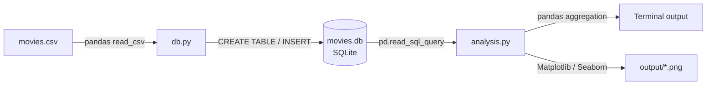

# Architecture – movies-sql-analytics

## Overview

A self-contained analytics project built on a normalized SQLite database.
Raw CSV data is loaded into a relational schema via `db.py`, then queried
through `analysis.py` using SQL and Python (pandas, Matplotlib, Seaborn).

---

## Project Structure

```
movies-sql-analytics/
│
├── data/
│   └── movies.csv              # Source dataset (raw movie data)
│
├── db/
│   ├── db.py                   # get_connection(), create_tables(), insert_data()
│   └── schema.sql              # DDL reference (CREATE TABLE statements)
│
├── output/
│   ├── scatter_plot.png        # Budget vs. revenue scatter plot (generated)
│   └── bar_plot.png            # Top 5 countries bar chart (generated)
│
├── analysis.py                 # SQL queries + pandas analysis + visualizations
├── requirements.txt
├── .gitignore                  # Excludes movies.db and output/
└── README.md
```

> `movies.db` is excluded from version control — it is generated locally
> by running `db.py`. See [Getting Started](#getting-started) in README.

---

## Data Flow



---

## Database Schema

The database follows a normalized relational model with junction tables
to handle many-to-many relationships between movies and their attributes.

```
movie ──────────────── movie_genres ─────── genre
  │                                           
  ├─────────────────── movie_countries ───── country
  │                                           
  ├─────────────────── movie_directors ───── director
  │                                           
  └─────────────────── movie_languages ───── language
```

| Table              | Description                              | Key columns                                 |
|--------------------|------------------------------------------|---------------------------------------------|
| `movie`            | Core film data                           | `movie_id`, `title`, `budget`, `box_office` |
| `genre`            | Genre lookup                             | `genre_id`, `name`                          |
| `country`          | Country lookup                           | `country_id`, `name`                        |
| `director`         | Director lookup                          | `director_id`, `name`                       |
| `language`         | Language lookup                          | `language_id`, `name`                       |
| `movie_genres`     | Movie ↔ Genre (M:N)                      | `movie_id`, `genre_id`                      |
| `movie_countries`  | Movie ↔ Country (M:N)                    | `movie_id`, `country_id`                    |
| `movie_directors`  | Movie ↔ Director (M:N)                   | `movie_id`, `director_id`                   |
| `movie_languages`  | Movie ↔ Language (M:N)                   | `movie_id`, `language_id`                   |

---

## Module Descriptions

### `db/db.py`

Responsible for all database setup and data loading.

| Function           | Description                                      |
|--------------------|--------------------------------------------------|
| `get_connection()` | Returns a `sqlite3.Connection` to `movies.db`    |
| `create_tables()`  | Executes DDL — creates all 9 tables if not exist |
| `insert_data(df)`  | Reads CSV via pandas, populates all tables       |

### `analysis.py`

Executes four analytical queries and produces visualizations.

| Section                        | SQL features used              | Python output                  |
|--------------------------------|--------------------------------|--------------------------------|
| Genre analysis (top 3)         | JOIN, GROUP BY, SUM, ORDER BY  | Table (terminal)               |
| Budget vs. revenue             | SELECT, AVG                    | Scatter plot, Pearson r        |
| Country analysis (top 5)       | JOIN, GROUP BY, AVG, ORDER BY  | Bar chart                      |
| Top 10 films by revenue        | ORDER BY, LIMIT                | Table (terminal)               |

---

## Technology Stack

| Layer         | Technology                          |
|---------------|-------------------------------------|
| Database      | SQLite 3 (via `sqlite3` stdlib)     |
| Data loading  | pandas `read_csv`, `read_sql_query` |
| Visualization | Matplotlib, Seaborn                 |
| Language      | Python 3.x                          |

---

## Design Decisions

**SQLite over MySQL** — No server required. The database is fully
reproducible from `movies.csv` by running `db.py`, making the project
portable and easy to run locally without any configuration.

**Junction tables** — Many-to-many relationships (e.g. a film can belong
to multiple genres) are resolved through explicit junction tables rather
than storing comma-separated values, ensuring the schema is in 3NF.

**Separation of concerns** — Database logic (`db.py`) is isolated from
analysis logic (`analysis.py`), following the same modular pattern used
in the `movies-omdb-enrichment` pipeline.
